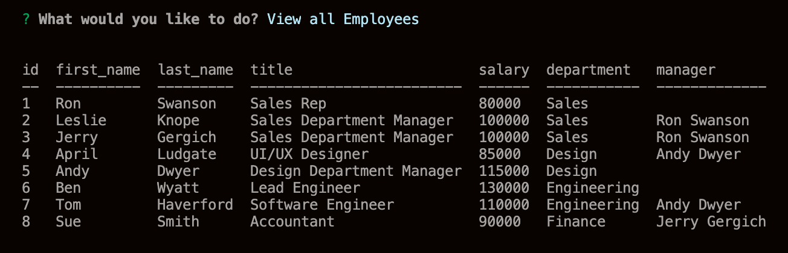
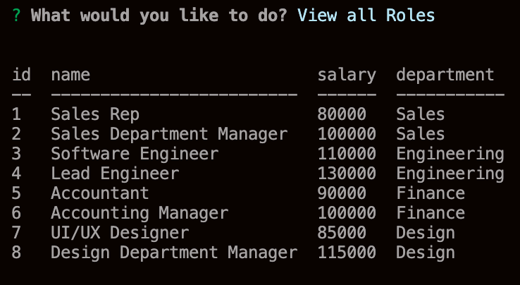

# [Employee Tracker](https://github.com/jpreston-alt/Employee-Tracker)

## Description

Employee Tracker is a command-line, Content Management System, that allows business owners to easily manage and track information about their employees. The user is first presented with a series of choices about what action they would like to complete, and then prompted with a series of follow up questions, based on that choice. The user may choose to view, add, or delete employees, roles, and departments. They may also choose to update the employees role or manager at any time. Once the user has answered the follow up questions, their chosen action is completed and they may choose another action, or choose to exit the program at any time.

Building this program taught me alot about building databases with MySQL, and about integrating those databases into a program so that the user can access and manipulate them. I learned how seperating data into different tables, and then using joins to correlate that data, makes it easier update and query data. I also learned how to connect to a mysqld server from the command-line and, how to utilize inquirer to query databases based on user input.


## Table of Contents
* [Usage](#usage)
* [Technologies](#technologies)
* [Questions](#questions)
* [Installation](#Installation)
* [Credits](#Credits)
* [Finished Product](#finished-product)

## Usage
* Navigate to Employee Tracker directory and install dependencies.
* Run node index.js to begin.
* Choose an action:
    * View all Employees
    * View all Employees By Manager
    * Add Employee
    * Remove Employee
    * Update Employee Role
    * Update Employee Manager
    * View all Roles
    * Add Role
    * Remove Role
    * View all Departments
    * Add Department
    * Remove Department
    * Nothing, I'm done.
* Answer follow up questions based on action chosen.
* Action is executed based on answers.
* Choose "Nothing, I'm done." to exit the program.


## Technologies
* MySQL
* Node.js
* JavaScript
* npm
* Inquirer.js


## Installation
To install necessary dependencies, run the following command: 
``` 
npm install 
``` 


## Credits
* [Inquirer.js](https://www.npmjs.com/package/inquirer)

## Finished Product
View a video of the full application [here](https://drive.google.com/file/d/1Tbr3_QlUWGbEfzQtI1TAzgLNuelevxEc/view). <br><br>






## Questions
​
If you have any questions about the repo, please contact me:

On GitHub: [jpreston-alt](https://github.com/jpreston-alt) | Via Email: joannappreston@gmail.com